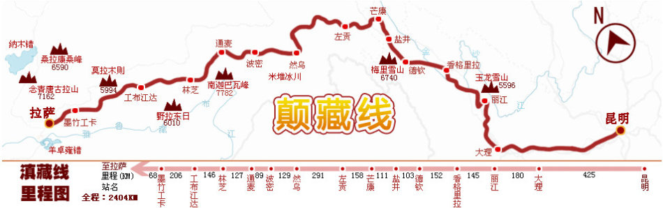

配速：15km/hour

|日期|出发/到达         |路线       |距离        |骑行时间   |hotel                                     |Contact|notice|
|:--:|:-:              |:-:       |:-:         |:-:        |:-:                                      |:-:     |:--:  |
|7/23|九溪镇-安宁市     |昆孟线     |102km       |7hour      |安宁佳宾宾馆 -安宁圆山南路圆山村住宅小区 (安宁市)|15969475828|
|7/24|安宁市-楚雄市     |G320       |147km      |10hour     |楚雄鸿邺宾馆|0878-3362066
|7/25|楚雄市-祥云       |G320       |145KM      |10hour     |祥云县三里园客栈|0872-3124298|
|7/26|祥云-大理市       |G320-G214  |69km       |5hour      |大理有媛客栈|18707177596
|7/27|大理市-鹤庆县     |S221       |132km      |9hour      |鹤庆福顺客栈(备干粮)|0872-4341998
|7/28|鹤庆县-丽江县     |S221       |43km       |3hour      |多情雍措青年客栈|0888-5143172|
|7/29|丽江县-虎跳峡-宝山村K2123|G214    |85km       |6hour   |宝山村顺路骑友驿站：冲江河电站前行|18760890689
|7/30|虎跳峡-香格里拉K2052 |G214       |80km       |6hour    |原素客栈|17708875099
|7/31|香格里拉-书松      |G214       |104km      |7hour      |书松村滇藏客栈|15284573298
|8/1|书松-飞来寺         |G214       |86km       |8hour      |飞来寺守望 6740|13988798098|爬白马雪山，连续上坡,道路选左边
|8/2 |飞来寺-盐井        |G214       |102km      |8hour      |盐井正宗面佳加面|13658957318|佛山-云南最后一个镇--澜沧江继续下坡|
|8/3 |盐井-芒康          |G214       |110km      |8hour     |.芒康吉祥宾馆|18898051978|道路比较险,翻红拉雪山
|8/4 |芒康-荣许兵站      |G318       |100km      |10hour     |六方驿站-18708081316|荣许兵站雅安饭店-15208081810|长上坡-10h海拔4200|
|8/5 |荣许兵站-左贡      |G318       |60km       |8hour      |左贡县蓝山青年旅社左贡县出城 500 米|13228959682|左贡山5000米
|8/6 |左贡-邦达镇        |G318       |103km      |11hour     ||邦达崃山食宿店|13980414887|海拔的升降|
|8/7 |邦达镇-八宿        |G318       |95km       |7hour      |八宿县三雅饭店--白马下街 36 号白马兵站旁|15208081898|怒江72拐，保持清醒，靠右急下弯
|8/8 |邦达镇-然乌        |G318       |90km       |7hour      |然乌一家小居客栈--然乌出去 6 公里瓦巴村，然乌湖边|13658091903|安目错湖，然乌湖-->长上坡
|8/9 |然乌-波密          |G318       |132km      |9hour      |波密玉仁客栈--：茂名路 20 号 |17708940968|雅隆藏布江一路向西-->林间穿梭+逆风|
|8/10 |波密-东久村       |G318       |130km       |10hour     |鲁朗东久乡龙王谷驿站--K4129|18309209985|102 塌方区,涉水区|
|8/11|东久村-八一镇      |G318       |102km       |10hour     |吉庆阁青年客栈--八一大街 376 号|13659591010|318上最险的一段路,塌方,堵路,时间会很长
|8/12|八一镇-工布江达    |G318       |130km       |10hour     |工布江达东旺安达骑友旅社（单车调试维修）县公安局东 30 米|13518948720|路上有狗；逆风，皱纹路-->尼洋河、巴松措湖
|8/13|工布江达-松多      |G318       |98km      |9hour      |松多豫鑫旅馆 进松多镇右侧第一家|15289143789|逆风,早出行--> 川藏线的最后一站，吃的很较贵
|8/14|松多-拉萨|G318    |G318        |176km      |7hour  |拉萨唐卡旅舍|13518914868-拉萨仙足岛生态小区1区2排12号--20|早起6:30出发|
||拉萨-->武汉||两天|